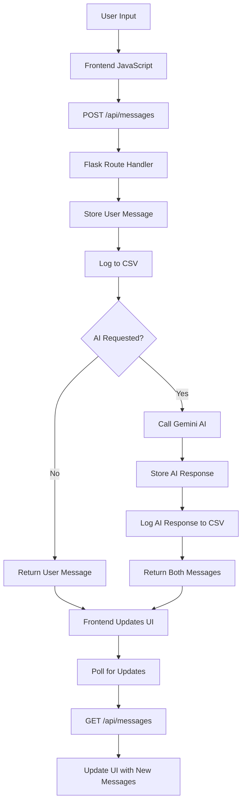

# Project Analysis: AI-Powered Message Board Application

## Overview

This project is a **full-stack web application** that implements an AI-powered message board using Flask (Python backend) and vanilla JavaScript (frontend). The application allows users to post messages and optionally receive AI-generated responses using Google's Gemini AI model.

## Project Architecture

### Core Components

```
sample_aidev_practice/
├── Backend (Flask/Python)
│   ├── app.py                 # Main Flask application
│   ├── ai/
│   │   ├── client.py          # AI client wrapper for Gemini API
│   │   └── __init__.py        # Python package initialization
│   └── requirements.txt       # Python dependencies
├── Frontend (HTML/JS/CSS)
│   ├── templates/
│   │   └── index.html         # Main UI template
│   ├── static/
│   │   ├── script.js          # Frontend JavaScript logic
│   │   └── style.css          # AI-specific styling
│   └── vite.config.js         # Frontend build configuration
├── Configuration
│   ├── .env                   # Environment variables (API keys)
│   ├── instance/config.py     # Additional configuration
│   └── package.json           # NPM scripts and dependencies
└── Testing & Utilities
    ├── test_api.py            # API testing script
    ├── create_test.py         # Gemini API test script
    └── list_models.py         # AI model listing utility
```

## Functional Analysis

### 1. **Message Management System**
- **In-Memory Storage**: Messages are stored in a Python list during runtime
- **CSV Logging**: All messages are persistently logged to `data.csv` with timestamps
- **Message Types**: Distinguishes between user messages and AI-generated responses
- **Unique Identification**: Each message gets a UUID for tracking

### 2. **AI Integration Layer**
- **Google Gemini Integration**: Uses the `google-generativeai` Python library
- **Model**: Configured to use `gemini-1.5-flash-latest`
- **Chat Context**: Maintains conversation history through Gemini's chat sessions
- **Error Handling**: Graceful degradation when AI services are unavailable
- **Optional Responses**: Users can toggle AI responses on/off per message

### 3. **Web Interface**
- **Single Page Application**: Dynamic content updates without page refresh
- **Real-Time Updates**: Polls server every 6 seconds for new messages
- **Responsive Design**: Dark theme optimized for modern browsers
- **Markdown Support**: AI responses are rendered as formatted markdown
- **Visual Differentiation**: AI messages have distinct styling and indicators

### 4. **API Endpoints**

#### GET `/api/messages`
- **Purpose**: Retrieve all messages
- **Response**: JSON array of message objects
- **Usage**: Frontend polling and initial page load

#### POST `/api/messages`
- **Purpose**: Create new message and optionally get AI response
- **Payload**: 
  ```json
  {
    "text": "User message content",
    "ask_ai": true/false
  }
  ```
- **Response**: Array containing the user message and AI response (if requested)

## Data Flow Architecture



## Technology Stack

### Backend Technologies
- **Flask 2.3.3**: Web framework for API endpoints and templating
- **Google Generative AI**: Integration with Gemini AI model
- **Python Dotenv**: Environment variable management
- **CSV Module**: Data persistence and logging
- **UUID Module**: Unique message identification

### Frontend Technologies
- **Vanilla JavaScript**: DOM manipulation and API communication
- **Marked.js**: Markdown parsing for AI responses
- **HTML5**: Semantic markup structure
- **CSS3**: Modern styling with flexbox and dark theme
- **Fetch API**: Asynchronous HTTP requests

### Development Tools
- **Vite**: Frontend build tool and development server
- **npm**: Package management and script runner
- **pip**: Python package management

## Key Features Analysis

### 1. **Dual Interface Support**
The application supports two development modes:
- `npm run dev`: Runs the Python Flask server
- `python app.py`: Direct Flask execution
- Both approaches serve the same application with identical functionality

### 2. **AI Response Toggle**
Users have granular control over AI interaction:
- Checkbox interface to enable/disable AI responses per message
- Maintains conversation context across multiple AI interactions
- Visual indicators distinguish AI responses from user messages

### 3. **Data Persistence Strategy**
Hybrid approach to data storage:
- **Runtime**: In-memory list for fast access during session
- **Persistence**: CSV file logging for data retention across restarts
- **Format**: Structured logging with timestamp, message type, and content

### 4. **Error Resilience**
- Graceful handling of AI API failures
- Continues normal operation when AI is unavailable
- User feedback for error conditions

## Security Considerations

### Current Security Issues
1. **Hardcoded API Keys**: Found in `create_test.py` and `instance/config.py`
2. **No Input Validation**: Limited sanitization of user input
3. **No Rate Limiting**: Potential for API abuse
4. **No Authentication**: Open access to all functionality

### Recommended Security Improvements
1. Move all API keys to environment variables
2. Implement input validation and sanitization
3. Add rate limiting for API endpoints
4. Consider implementing user authentication
5. Add CSRF protection for form submissions

## Performance Characteristics

### Scalability Limitations
- **Memory Storage**: Limited by server RAM, not suitable for high-volume usage
- **Single Instance**: No horizontal scaling capability
- **Synchronous Processing**: May block on AI API calls

### Optimization Opportunities
1. Implement database storage (SQLite, PostgreSQL)
2. Add asynchronous processing for AI requests
3. Implement message pagination
4. Add caching for frequently accessed data
5. Consider WebSocket connections for real-time updates

## Use Cases and Applications

### Primary Use Cases
1. **AI Experimentation**: Testing AI integration patterns
2. **Prototype Development**: Rapid prototyping of chat interfaces
3. **Educational Tool**: Learning Flask and AI API integration
4. **Development Reference**: Example of full-stack application architecture

### Potential Extensions
1. **Multi-User Support**: User accounts and private conversations
2. **Message Threading**: Conversation organization
3. **File Attachments**: Media sharing capabilities
4. **Export Functionality**: Data export in various formats
5. **Advanced AI Features**: Different AI models, custom prompts

## Development Workflow

### Setup Process
1. Install Python dependencies: `pip install -r requirements.txt`
2. Install Node.js dependencies: `npm install`
3. Configure environment variables in `.env` file
4. Run application: `npm run dev` or `python app.py`

### Testing Approach
- **Manual Testing**: Web interface interaction
- **API Testing**: Using `test_api.py` script
- **AI Testing**: Using `create_test.py` for Gemini API validation

## Code Quality Assessment

### Strengths
- Clear separation of concerns between frontend and backend
- Modular AI client implementation
- Consistent error handling patterns
- Well-structured HTML and CSS

### Areas for Improvement
- Add comprehensive unit tests
- Implement logging framework
- Add API documentation (OpenAPI/Swagger)
- Standardize error response formats
- Add type hints for Python code

## Conclusion

This project represents a well-structured prototype for AI-integrated web applications. It successfully demonstrates key concepts including REST API design, AI service integration, and modern frontend development practices. While suitable for experimentation and learning, production deployment would require addressing security, scalability, and persistence concerns.

The codebase provides an excellent foundation for understanding full-stack development with AI integration and serves as a practical reference for similar projects.